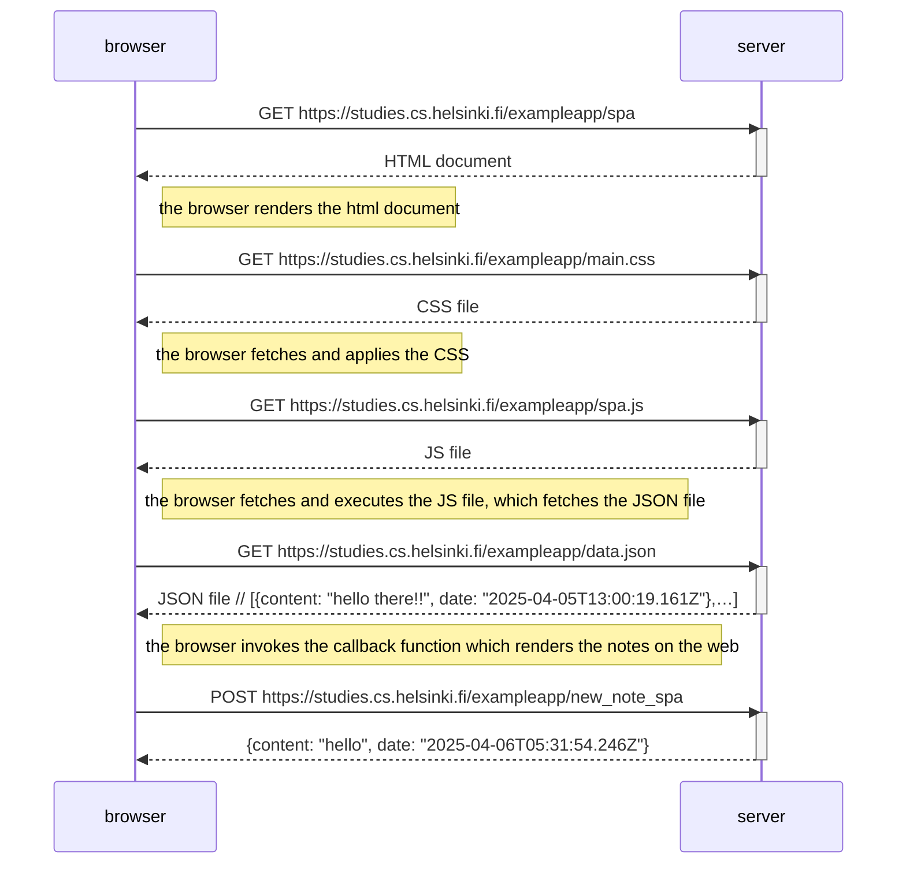

```mermaid
sequenceDiagram
    participant browser
    participant server

  browser->>server: GET https://studies.cs.helsinki.fi/exampleapp/spa
    activate server
    server-->>browser: HTML document
    deactivate server

  note right of browser: the browser renders the html document

  browser->>server: GET https://studies.cs.helsinki.fi/exampleapp/main.css
    activate server
    server-->>browser: CSS file
    deactivate server

   note right of browser: the browser fetches and applies the CSS

  browser->>server: GET https://studies.cs.helsinki.fi/exampleapp/spa.js
    activate server
    server-->>browser: JS file
    deactivate server

   note right of browser: the browser fetches and executes the JS file, which fetches the JSON file

  browser->>server: GET https://studies.cs.helsinki.fi/exampleapp/data.json
    activate server
    server-->>browser: JSON file // [{content: "hello there!!", date: "2025-04-05T13:00:19.161Z"},…]
    deactivate server

   note right of browser: the browser invokes the callback function which renders the notes on the web

  browser->>server: POST https://studies.cs.helsinki.fi/exampleapp/new_note_spa
    activate server
    server-->>browser: {content: "hello", date: "2025-04-06T05:31:54.246Z"}
    deactivate server


```
